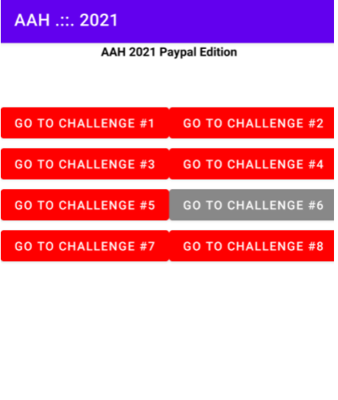

# AAH2021 PayPal edition

https://bughunters.google.com/learn/presentations/5783688075542528

Uygulamayı `adb push uygulama-dosyası` komut ile cihaza yükleyebiliriz veya emülatör üzerine bırakarak da uygulama yüklenebilir. Bu işlemden sonra uygulama açıldığı zaman görseldeki gibi 8 adet challange içermektedir.

## Challange 1 
İlk soruda kullanıcıdan alacağı girdiyi doğrulamak üzere bir yapı bulunmaktadır.

jadx aracı ile apk dosyasını okunabilir kodlara dönüştürebiliyoruz. Challange1Activity içerisinde doğrulama işlemi butona tıklandığı zamanda validateChallange01flag() fonksiyonu ile gerçekleşmektedir.

Fonksiyon içeriği incelendiğinde flag değerinin return edildiği görülmektedir. 

## Challange 2
Burada da ilk soruya benzer şekilde kullanıcıdan bir girdi isteyerek doğrulamaktadır.
Random bir girdi girdiğimizde ekran üzerinde hiçbir geribildirim olmadığını görebiliriz. Terminal üzerinde `adb logcat` komutu ile loglar incelenebilir.Burada butona basıldığında bazı loglamaların olduğunu gözlemliyoruz.

jadx aracı ile açtığımız uygulamanın Challange02Activity sınıfı incelenecektir. Doğrulama işlemini burada `validateChallange02Flag()` fonksiyonu gerçekleştirmektedir. Fonksiyon içerisinde xor anahtarı ve verilen bir dizi sayı ile encryption işlemi yapılır ve `str2` isimli flag oluşturup kullanıcıdan gelen girdi ile eşitliğini kontrol etmektedir. Bunu da log içerisinde yazmış olduğunu anlayabiliriz.

Öncesinde logcat içerisinde yer alan metinler içerisinde flag değerimiz bulunmakta olduğunu tespit edilmektedir. Bulunan değer girilerek Toast mesajı içerisinde geçerli olduğunu görebiliriz.

## Challange 3

"GO TO CHALLANGE 3" butonuna basıldığında aktiviteyi başlatmak için diğer bir yolunun bulunması gerektiğini söylemektedir. Yine jadx aracı ile ilgili kod parçasının olduğu kısmı inceliyoruz. Bu kısım `MainActivity` içerisinde yer almaktadır.
