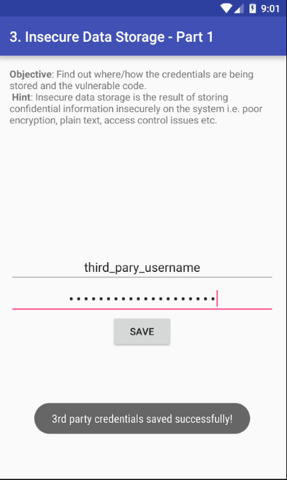
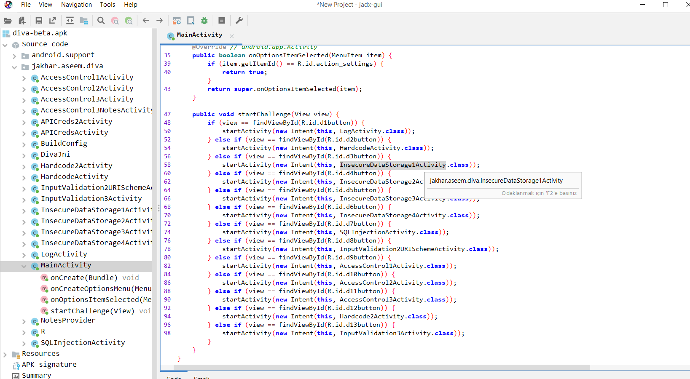
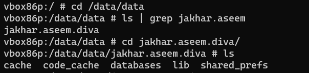
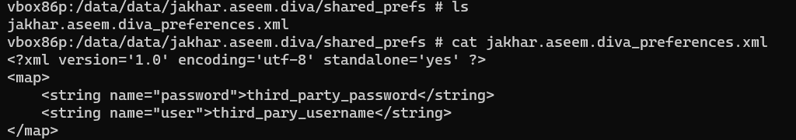
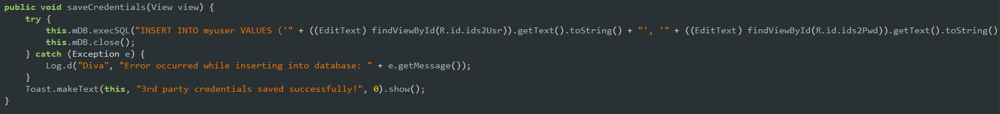
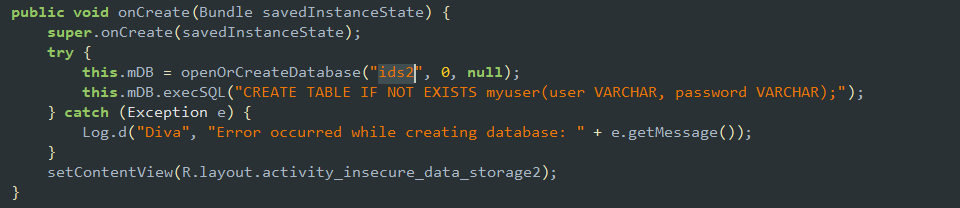
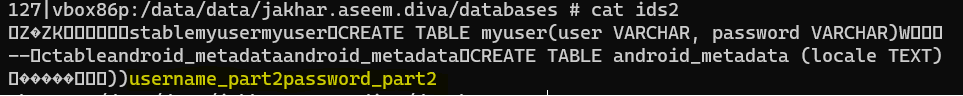
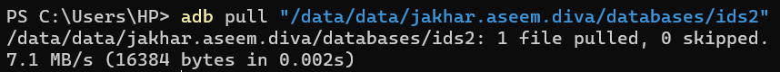

# [DIVA App](https://github.com/payatu/diva-android)
İçerisinde toplamda 13 adet güvenli veya yanlış kodlama üzerine örnek bulunmkatadır. Geliştiricilerin yaptığı veya yapabileceği yanlış kodlama uygulama içerisinde zafiyet oluşturabilmektedir.

# **Insecure Data Storage
## 1. Part 1

İlk bölümde bizden bir kullanıcı adı ve şifre girip onun nereye nasıl kaydedildiğini bulmamız isteniyor. Kullanıcı adı ve şifre kısmına, *third_party_username,third_party_password* girdim.

Bilgileri kaydettikten sonra `jadx` aracını kullanarak apk dosyasını okunabilir olarak açabiliyoruz. Kodu incelememizin amacı bilgilerin nasıl kaydedildiğini anlayabilmek.
Uygulamamızı açtıktan sonra MainActivity kısmına gelerek ilgili sınıfı bulmamız gerekiyor

InsecureDataStorage1Activity üzerine gelerek çift tıklıyoruz ve ilgili sınıf açılıyor. içerisinde  `saveCredentials()` isimli fonksiyon bulunmakta. Burada yapılan işlem kullanıcıdan alınan bilgilerin açık metin olarak SharedPreferences yapısını kullanarak kadyedilmesidir.

Kod incelememiz burada tamamlanıyor ve `adb shell` komutu ile cihaz içerisinde shell açabiliyoruz ve uygulamanın oluşturduğu dosyaları inceleyebiliyoruz. uygulama paket dizinine gidiyoruz. 

shared_prefs klasörü içerisinde girilen bilgileri içeren xml dosyası bulunmaktadır. Dosyanın içeriğine bakıldığında açık metin olarak kullanıcı bilgilerine kolay bir şekilde erişilebilmektedir. 

## Part 2
Birinci kısıma benzer şekilde kullanıcı adı ve şifre isteniyor. *username_part2, password_part2* olarak girdim.  `saveCredentials()` fonksiyonunda kullanıcı bilgileri sql veritabanı içerisine açık metin olarak kaydedilmektedir.

`adb shell` komutu ile cihaza erişim sağlanır ve `/data/data` dizini içerisinde database klasörüne gidilmektedir. Çünkü bilgiler veritabanına kaydediliyor. Oluşturulan veritabanı ismi ids2.

shell üzerinden dosyayı açtığımızda tam okunabilir olmuyor ama girilen bilgiler görüntülenebilmektedir.

Dosyayı `adb pull` komutu ile  yerel cihaza yükleyip uygun program ile açabiliriz.

## Part 3

## Part 4
