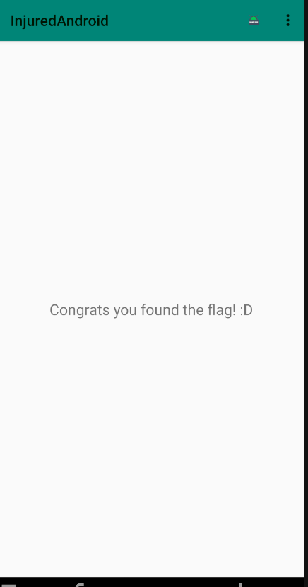

# InjuredAndroid
CTF tarzında basit seviyedeki zafiyetleri içeren Android uygulamasıdır. 20 farklı soru içermektedir. Giriş işlemlerinden,veritabanı ile ilgili birçok konulara değinilmiştir.
Uygulama sdkVersion=29, analiz cihazımız genymotion üzerinden Google Pixel 3XL android 9.0 cihazı kullanılmaktadır. Uygulama için genymotion android 8 için arm translation paketi indirilmiştir.

**Konu başlıkları**
1. Login Vulnerabilities
2. Insecure Components
3. Insecure Data Storage

Girilen flag değerleri **Flags Overview** kısmından kontrol edilmektedir.

# 1. Login Vulnerabilities

## FLAG 1 -Login

Ekranda yukarıda görseldeki gibi flag değeri girmemizi istemektedir. Kod içeriğini incelemeden önce aşağıdaki kırmızı renkteki bilgilendirme butonuna tıklamalarında "Flag tam burnunun ucunda" içeriğinde mesaj kutucuğu belirmektedir. 

jadx aracı ile apk dosyasını açıyoruz.İlgili aktivite sınıfı "FlagOneLoginActivity". 
Sınıf içerisinde `submitFlag()` isimli fonksiyon flag değerinin gönderildiği kısımdır. Koşul durumunda kontrol edilen `g.a()` fonksiyonu, parametre olarak kullanıcıdan aldığı girdi ve bir string şeklinde 2 tane metin almaktadır. 

g.a() fonksiyon içeriği incelendiğinde girilen parametrelerin eşitliğini kontrol ettiği anlaşılmaktadır.

g.() fonksiyonunda parametre olarak girilen açık metin flag değeridir.

Flags Overview ekranında girilen flag değerleri yeşil renk olmaktadır.

## FlagThreeActivity

Ekranda girdi olarak flag değeri istenmektedir. Bilgilendirme olarak **R** sınıfının resources olduğunu ve **.xml** dosyaların kontrol edilmesi gerektiği belirtilmektedir.
jadx aracını kullanarak *FlagThreeActivity* sınıfı incelendiğinde `submitFlag()` fonksiyonu içerisinde kullanıcıdan aldığı girdi ile  `R.string.cmVzb3VyY2VzX3lv` olan flag değerinin doğrulamasının yapıldığı bölümdür.

resources > values > strings.xml dosyası bulunmaktadır. Uygulamadaki  string değerleri içermektedir.

**strings.xml** dosyası içerisinde **ctrl+F** ile yukarıdaki string değerini arattığımız zaman flag değerini elde etmekteyiz.

## FlagFour - Login 2

Kullanıcıdan flag değerini girmesi beklenmektedir. Bilgilendirme mesajlarında "Bob nerede" ve sınıflar ve import edilen kütüphaneler dikkat çekilmektedir.

jadx ile açılan uygulamada FlagFourActivity sınıfı incelenmektedir. Diğer sorulara benzer şekilde burada da `submitFlag()` fonksiyonu bulunmaktadır.

Fonksiyon içerisinde flag değerinin şifrelendiğini (encryption) anlayabiliriz.
Decryption yapıldığı işlemi iki yoldan bulabiliriz. Birincisi, `byte[] a2 = new g().a();`
tanımlanan objenin **g** sınıfı içerisini inceleyebiliriz.

**f1468a** nesnesi tanımında verilen base64 metninin decode halini flag olarak girilirse, flag değerini onaylamaktadır.

## Flag Six - Login 3
**FlagSixLoginActivity** sınıfını inceliyoruz. Bu challange iki yol ile de çözülebilir. İlk yol kod analizi yaparak metotları incelemek bu kısım uzun sürebilir. Diğer bir yöntem ise frida aracı ile metot hooklama yöntemidir. 

**Kod analizi ile metotların incelenmesi**

Aktivite içerisinde flag değerinin doğrulandığı `submitFlag()` metodu içerisinde, koşul içerisinde flag değerinin encrypt edilmiş hali bulunmaktadır. Şifreleme işlemini, sınıf **k** içerisinde bulunan **a()** isimli metot içerisinde gerçekleşmektedir. 
Parametre olarak verilen flag değeri, base64 ile çözüldükten sonra, bir önceki satırda üretilen anahtar ile son çözülme işlemi gerçekleşmektedir.

Oluşturulan DES anahtarı, parametre olarak `byte[] key` almaktadır ve bu "key"in ilk 8 baytını kullanır. Parametre olarak verilen key aşağıdaki görselde gösterilmektedir.

İlgili decoding işlemini gerçekleşen fonksiyonun düzenlenmiş java kodu.

Düzenlenen kod parçası, compiler kullanarak veya terminal üzerinden de çalıştırılabilir. Decode.java isimli dosya oluşturup çalıştırıldığı zaman flag değeri bulunmaktadır. 

Burada flag değeri kod analizi ile çözülmüştür. Kod içeriği çok daha karmaşık ve okunabilir durumda olmayabilir. Metot sayısı fazla olabilir bu yüzden yukarıdaki aşamaları takip etmesi mümkün olmayabilir.  Bu durumda diğer yöntem olarak bahsedilen frida aracı kullanılabilmektedir.

**Frida ile metot hooklama yöntemi**
Hooklama, metotun işleyişini değiştirme olarak açıklanabilir. Uygulama içerisine, javascript kodlarının yerleştirilmesi sağlanmaktadır.

- [ ]  Frida aracını kullanarak decrypt etme

# 2. Insecure Components
## FlagTwoActivity

**FlagTwoActivity** ekranında ana aktivitenin atlatılıp diğer aktivitelerin çalıştırılabilir yöntemi olduğunu söyleyen bir yazı bulunmaktadır. Bilgilendirme mesajı olarak, anahtar kelimelerin *aktivite* ve *exported* sözcükleri olduğu yazmaktadır. Exported aktivity, uygulamadan bağımsız çağırılabilen diğer uygulamaların da erişebildiği aktivitelerdir.
`adb shell` ile cihaza bağlanıp *activity manager* kullanacağız. Manfiest dosyası içerisinden, paketin ismi, **b3nac.injuredandroid**, exported aktivity ismi aynı paket içerisinden **b25lActivity**

shell üzerinden `am start -n b3nac.injuredandroid/.b25lActivity` kod çalışıtırılıyor. Ekranda gösterilen flag değerine ulaşıyoruz.

"Flag Overview" kısmından Flag 2 butonunun yeşil olduğu görülebilmektedir.

## Flag 5 Exported Broadcast Receiver
Butona tıklandığı anda ekrana Toast mesaj yansıtılaktadır.

Manisfest dosyası içerisinden **FlagFive Receiver** ilgili sınıfa gidilir.

Snackbar ile her `onReceive()` metodu çalıştığında mesajlar ekranda gösterilmektedir. En son gösterilen "You are a winner .." başlıklı mesajda flag değeri bulunmaktadır.

# 3. Insecure Data Storage
## FlagSevenSqliteActivity

# Kaynaklar
- https://github.com/B3nac/InjuredAndroid
-  [Android Hacking workshop by @B3nac Sec ](https://www.youtube.com/watch?v=PMKnPaGWxtg&list=PLrIM_Ohh4UNOxxduGNMGx9aYIq7CMKweE)
- https://infosecwriteups.com/injuredandroid-ctf-writeup-41dd40165cfa
