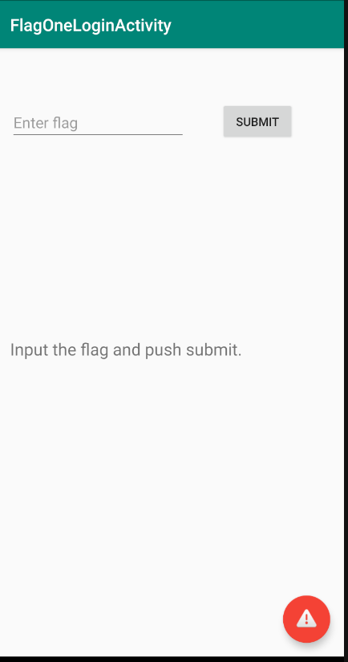
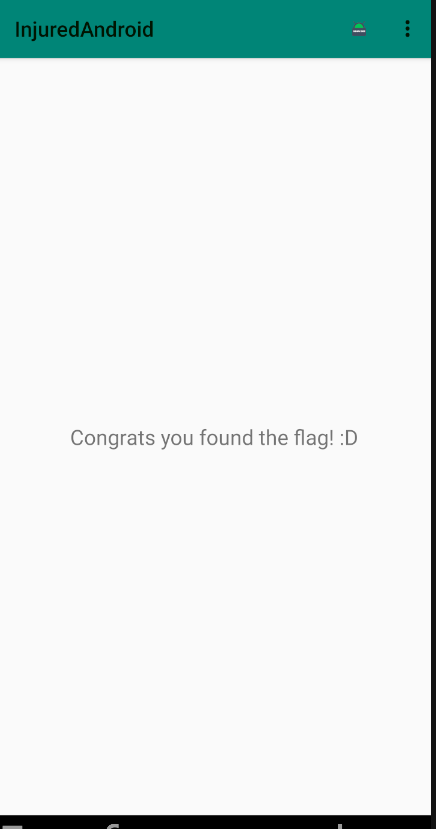

# InjuredAndroid
CTF tarzında basit seviyedeki zafiyetleri içeren Android uygulamasıdır. 20 farklı soru içermektedir. Giriş işlemlerinden,veritabanı ile ilgili birçok konulara değinilmiştir.
Uygulama sdkVersion=29, analiz cihazımız genymotion üzerinden Google Pixel 3XL android 9.0 cihazı kullanılmaktadır. Uygulama için genymotion android 8 için arm translation paketi indirilmiştir.

Girilen flag değerleri **Flags Overview** kısmından kontrol edilmektedir.

## XSSTEXT
## FLAG 1 -Login

Ekranda yukarıda görseldeki gibi flag değeri girmemizi istemektedir. Kod içeriğini incelemeden önce aşağıdaki kırmızı renkteki bilgilendirme butonuna tıklamalarında "Flag tam burnunun ucunda" içeriğinde mesaj kutucuğu belirmektedir. 

jadx aracı ile apk dosyasını açıyoruz.İlgili aktivite sınıfı "FlagOneLoginActivity". 
Sınıf içerisinde `submitFlag()` isimli fonksiyon flag değerinin gönderildiği kısımdır. Koşul durumunda kontrol edilen `g.a()` fonksiyonu, parametre olarak kullanıcıdan aldığı girdi ve bir string şeklinde 2 tane metin almaktadır. 

g.a() fonksiyon içeriği incelendiğinde girilen parametrelerin eşitliğini kontrol ettiği anlaşılmaktadır.

g.() fonksiyonunda parametre olarak girilen açık metin flag değeridir.

Flags Overview ekranında girilen flag değerleri yeşil renk olmaktadır.

## FlagTwoActivity

**FlagTwoActivity** ekranında ana aktivitenin atlatılıp diğer aktivitelerin çalıştırılabilir yöntemi olduğunu söyleyen bir yazı bulunmaktadır. Bilgilendirme mesajı olarak, anahtar kelimelerin *aktivite* ve *exported* sözcükleri olduğu yazmaktadır. Exported aktivity, uygulamadan bağımsız çağırılabilen diğer uygulamaların da erişebildiği aktivitelerdir.
`adb shell` ile cihaza bağlanıp *activity manager* kullanacağız. Manfiest dosyası içerisinden, paketin ismi, **b3nac.injuredandroid**, exported aktivity ismi aynı paket içerisinden **b25lActivity**

shell üzerinden `am start -n b3nac.injuredandroid/.b25lActivity` kod çalışıtırılıyor. Ekranda gösterilen flag değerine ulaşıyoruz.

 "Flag Overview" kısmından Flag 2 butonunun yeşil olduğu görülebilmektedir.

## FlagThreeActivity

Ekranda girdi olarak flag değeri istenmektedir. Bilgilendirme olarak **R** sınıfının resources olduğunu ve **.xml** dosyaların kontrol edilmesi gerektiği belirtilmektedir.
jadx aracını kullanarak *FlagThreeActivity* sınıfı incelendiğinde `submitFlag()` fonksiyonu içerisinde kullanıcıdan aldığı girdi ile  `R.string.cmVzb3VyY2VzX3lv` olan flag değerinin doğrulamasının yapıldığı bölümdür.

resources > values > strings.xml dosyası bulunmaktadır. Uygulamadaki  string değerleri içermektedir.

**strings.xml** dosyası içerisinde **ctrl+F** ile yukarıdaki string değerini arattığımız zaman flag değerini elde etmekteyiz.

# Kaynaklar
- [Android Hacking workshop by @B3nac Sec ](https://www.youtube.com/watch?v=lhRXV9LZ7bY)
- https://github.com/B3nac/InjuredAndroid
- 
